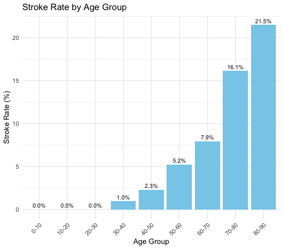
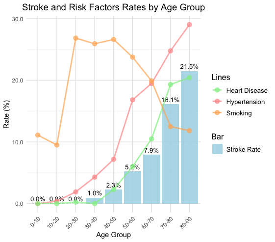
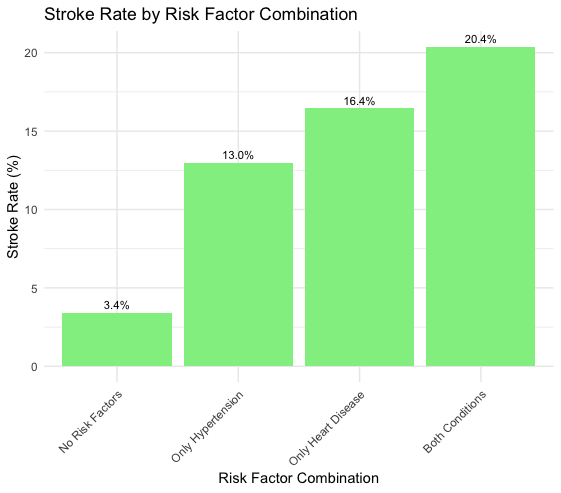
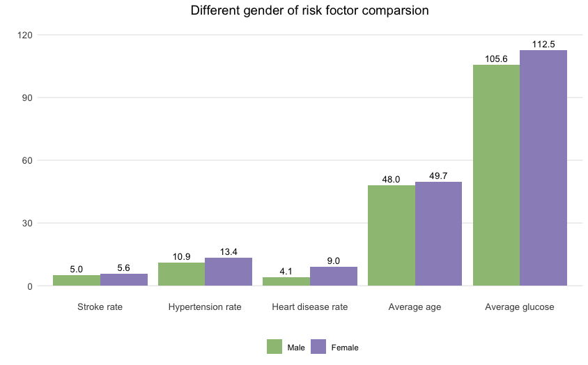
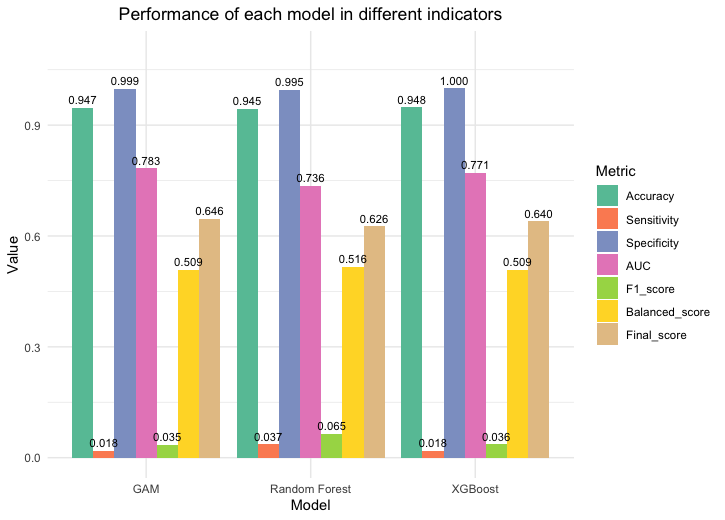

# 中風預測模型研究：整合年齡分層與風險因子分析

## 研究概述
本研究利用現代統計與機器學習技術，建立精確的中風預測模型，並深入探討影響中風發生的關鍵因素。中風是全球主要的死亡和失能原因之一，根據世界衛生組織(WHO)的統計，全球每年約有1500萬人罹患中風，其中500萬人因此死亡，另有500萬人導致永久失能。
我們比較了三種不同特性的預測模型：

**廣義加性模型 (GAM)
隨機森林 (Random Forest)
極限梯度提升 (XGBoost)**

## 研究目的
- 建立多元預測模型：比較三種不同特性的統計模型在中風預測上的表現
- 評估關鍵風險因子：分析平均血糖濃度、高血壓、心臟病和年齡對中風風險的影響
- 模型效能評估與比較：通過ROC曲線、AUC、敏感度和特異度等指標全面評估模型性能
- 轉化為實務應用：為臨床醫療提供科學依據，協助制定個人化預防策略

## 資料來源
研究使用Fedesoriano於2020年在Kaggle平台發布的腦中風預測資料集（Stroke Prediction Dataset），經資料清理後保留了3,425筆完整觀測值，包含以下主要變數：

- 性別 (gender)
- 年齡 (age)
- 高血壓 (hypertension)
- 心臟病 (heart_disease)
- 婚姻狀況 (ever_married)
- 工作類型 (work_type)
- 居住類型 (Residence_type)
- 平均血糖值 (avg_glucose_level)
- 體重指數 (bmi)
- 吸菸狀態 (smoking_status)
- 中風 (stroke)

## 主要研究發現

### 風險因子分析

**年齡層別與中風風險：**

- 低年齡層（0-30歲）：中風發生率接近於零
- 中年層（30-60歲）：30-40歲人群的中風發生率約1.0%，50-60歲升至5.2%
- 高年齡層（60歲以上）：60-70歲人群的中風發生率為7.9%，70-80歲升至16.1%，80-90歲進一步攀升至21.5%

**多重風險因子效應：**

- 無任何風險因子：中風發生率為3.4%
- 僅有高血壓：中風發生率為13.0%
- 僅有心臟病：中風發生率為16.4%
- 同時患有高血壓和心臟病：中風發生率高達20.4%

**性別差異：**

- 男性整體中風發生率（5.60%）略高於女性（5.03%）
- 男性的高血壓（13.44%）和心臟病（9.04%）盛行率均高於女性
- 吸菸對男性中風風險的影響更為顯著

**模型效能比較：**

三種模型在測試集上的預測表現：

- GAM模型：最佳的整體預測能力，AUC值最高
- 隨機森林：在識別中風案例方面表現最佳，敏感度和F1分數最高
- XGBoost：在準確率和特異度方面表現最優

## 結論與建議
### 研究結論

1. 中風風險隨年齡顯著增加，65歲以上人群的風險尤其明顯
2. 高血壓與心臟病對中風風險有顯著影響，多重風險因子共存時風險大幅增加
3. 三種模型各有優勢：GAM適合整體預測，隨機森林適合識別高風險個案，XGBoost適合準確篩查
4. 最佳預測閾值通常在0.3-0.4之間，能夠平衡敏感度和特異度

### 未來研究建議

1. 數據收集與模型優化：
- 擴大樣本規模，特別是增加年輕族群的中風案例
- 納入更多風險因子，如家族病史、飲食習慣等
- 探索深度學習方法在中風預測中的應用

2. 臨床應用：
- 開發臨床決策支援系統
- 設計個人化風險評估量表
- 建立高風險族群的追蹤機制

#### 環境要求

R (≥ 4.0.0)

**必要套件：**
dplyr、ggplot2、corrplot、MASS、Epi、ResourceSelection、mgcv、pROC、randomForest、xgboost、ROSE、reshape2、readr、tidyverse
